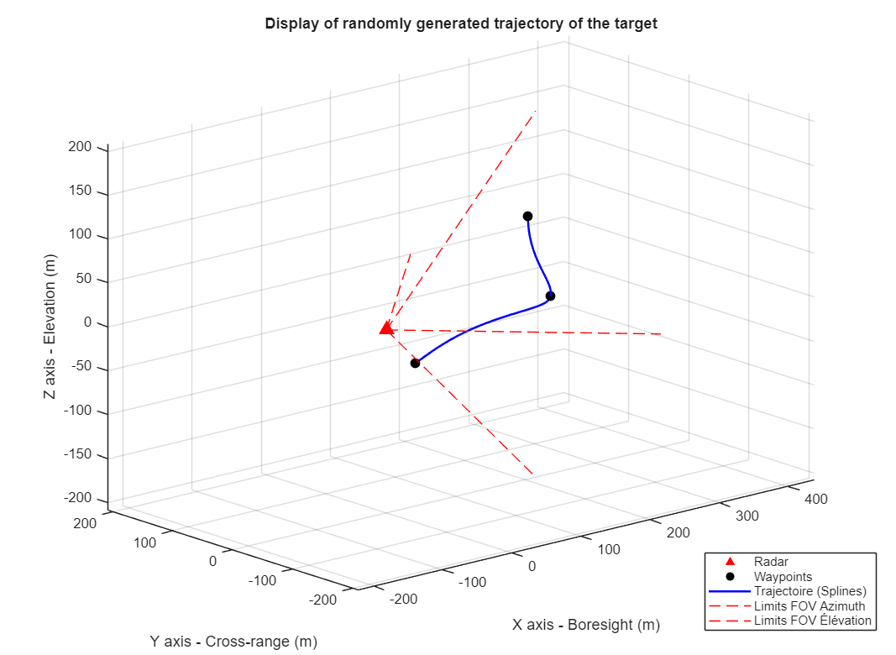
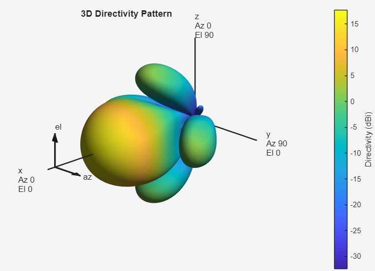
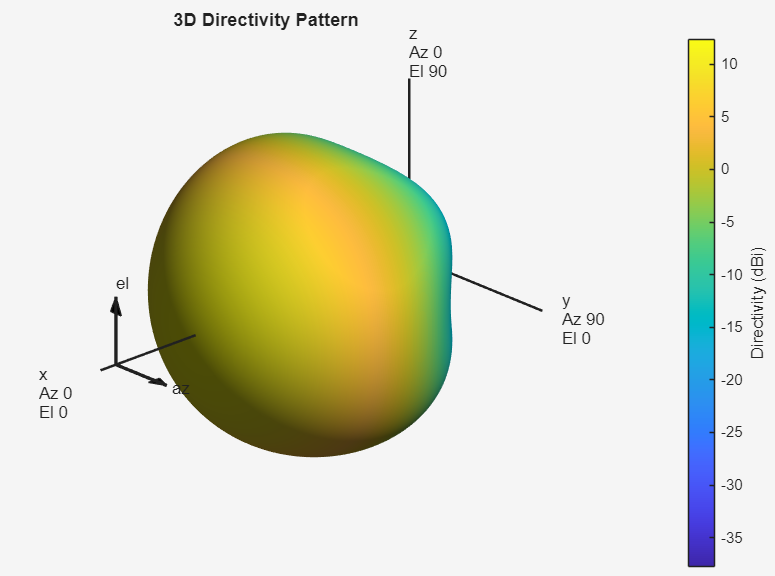
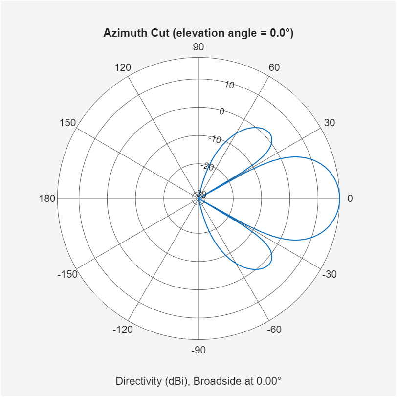
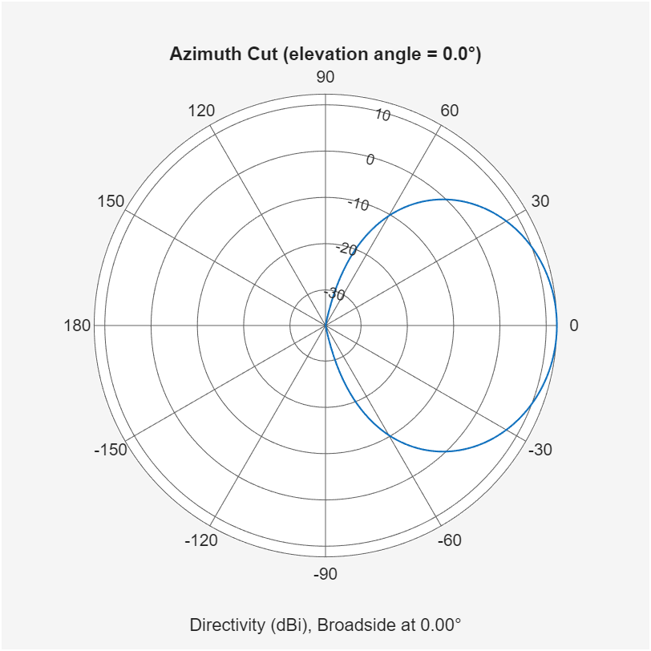
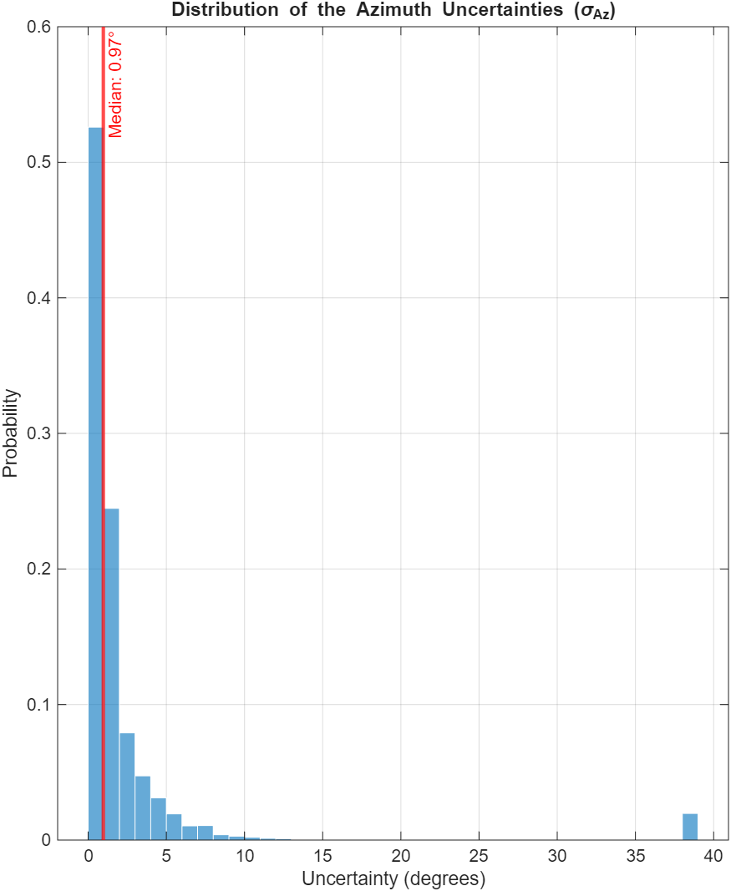
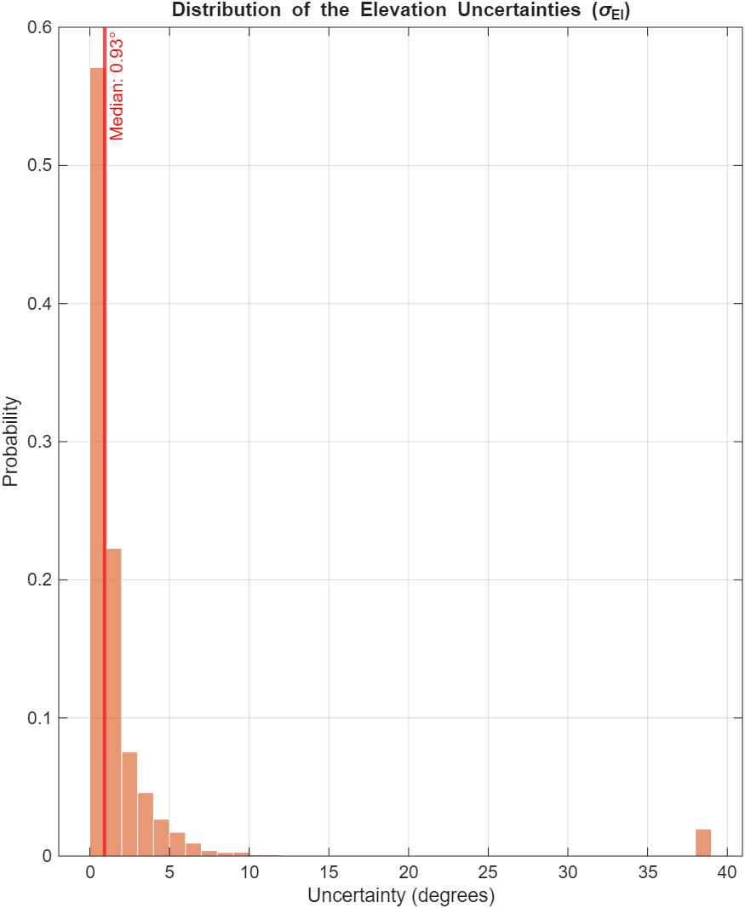
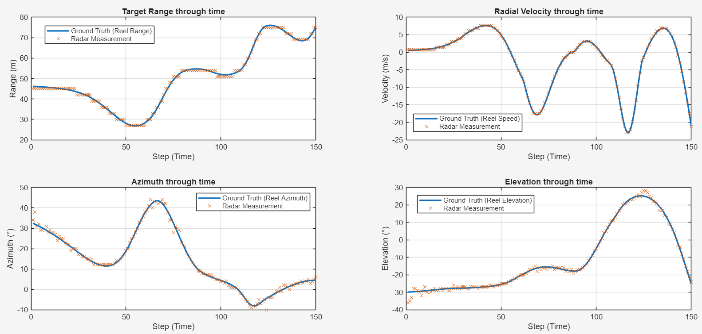
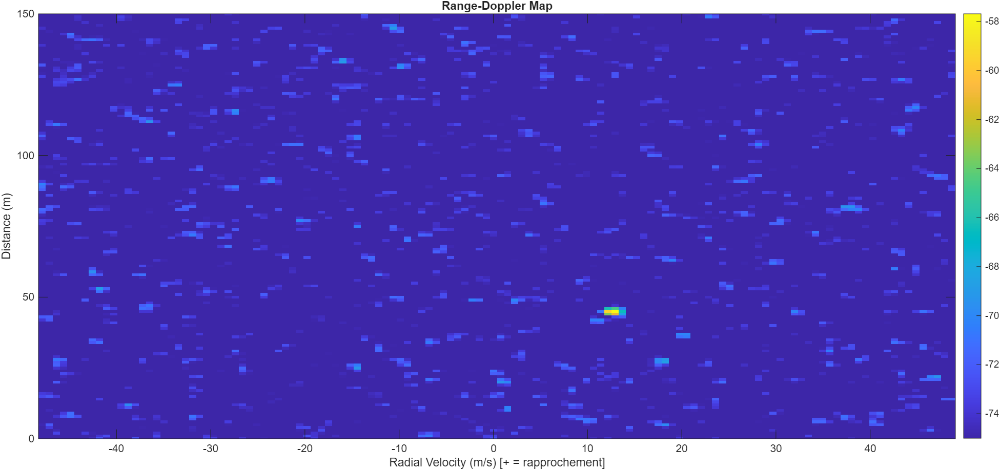

# FMCW Radar Scenario & Dataset Simulator

A highly modular MATLAB-based simulator designed to generate dynamic FMCW radar detection scenarios. This tool allows users to experiment with various radar configurations and generates realistic synthetic datasets (.csv and .mat) that can be used to train and test tracking algorithms (like Kalman Filters) or Machine Learning models.

*Example of a dynamically generated 3D random trajectory within the radar's detection volume.*

## 🎯 Project Overview

As a student project, the primary goal was to build a flexible simulation environment that bridges the gap between hardware configuration and high-level data processing. 

Instead of hardcoding detection boundaries, this simulator features a **dynamic scenario generation algorithm**. It calculates the maximum detection range $R_{max}(\theta)$ on the fly by interpolating the physical radiation pattern of the configured antenna array. If you change the antenna design (e.g., switching from a 2x2 to a 4x4 array), the trajectory generator automatically adapts its constraints to the new physical limits.

Beyond spatial constraints, the trajectory generation relies on a sophisticated and dynamic randomization algorithm. For every scenario, the simulator randomly selects a number of waypoints and computes variable travel times between them using controlled time deviations. To ensure a smooth and mathematically stable completion of the trajectory, the algorithm continuously recalculates the remaining mean travel time and adjusts the physical bounds after each step. This intelligent randomization guarantees that every generated path is entirely unique, physically plausible, and perfectly synchronized with the total simulation time without any risk of edge-case crashes.

## ✨ Key Features

*   **Modular Radar Hardware:** Easily tweak carrier frequency, bandwidth, transmit power, and antenna array dimensions (Uniform Rectangular Arrays).
*   **Dynamic Trajectory Generation:** Targets follow a random walk constrained by the physical detection limits of the radar (calculated via the radar equation and antenna gain pattern).
*   **Full Signal Processing Pipeline:**
    *   Range-Doppler Response (2D-FFT).
    *   2D CFAR (Constant False Alarm Rate) detection.
    *   DOA (Direction of Arrival) estimation using the MUSIC algorithm.
*   **Angular Uncertainty Analysis:** Leverages the MUSIC algorithm's spectrum to perform a 2D Gaussian approximation of the peak, determining the standard deviation (uncertainty) of the angular measurements.
*   **Ground Truth vs. Measurements Comparison:** Computes the theoretical ideal measurement values from the ground truth, allowing a direct comparison between the raw radar outputs and a perfectly functioning theoretical system.
*   **Dataset Export:** Automatically exports generated scenarios in `.csv` and `.mat` formats containing both discrete radar measurements and continuous ground truth data.

## 📊 Visualizing the Physics

The simulator includes specific display functions to visualize the hardware setup and its capabilities.

### Antenna Array Modularity
You can effortlessly switch configurations (e.g., 2x2 for wide coverage, 4x4 for high directivity). The scenario generation space adapts automatically to the antenna type you are using.

  
  

*Left: 3D radiation pattern of a 4x4 array elements. Right: 3D radiation pattern of a 2x2 array elements.*

  
  

*Left: 2D radiation pattern of a 4x4 array elements. Right: 2D radiation pattern of a 2x2 array elements.*

### Statistical Analysis
The simulator can assesse the quality of the MUSIC DOA estimation by generating detailed error distributions, allowing you to build accurate covariance matrices for your tracking algorithms.

  
  

*Left: Distribution of Azimuth measurement uncertainties for a 4x4 array elements. Right: Same for Elevation.*

### Measurements vs. Ground Truth
The simulator can generate visual comparisons between the raw radar measurements and the theoretical ideal values calculated from the ground truth across all dimensions.

*Comparison of measured vs. theoretical values for Range, Radial Velocity, Azimuth, and Elevation over a simulated scenario.*

### Range-Doppler Response
The simulator can compute the 2D-FFT of the received FMCW signal to generate a Range-Doppler map. This matrix serves as the foundation for the CFAR detection algorithm by isolating target echoes from the noise floor.

*2D Range-Doppler map highlighting the target's peak power across range and radial velocity bins.*

## 📁 Output Datasets Format

The generated `.csv` files are structured to provide everything needed for algorithm testing. Each row represents a single measurement frame:

| Radar Measurements (Discrete) | Ground Truth (Continuous) |
| :--- | :--- |
| `Range (m)` | `True Position X (m)` |
| `Radial Velocity (m/s)` | `True Position Y (m)` |
| `Azimuth (°)` | `True Position Z (m)` |
| `Elevation (°)` | `True Velocity X, Y, Z (m/s)` |

*Note: Missing detections (when the target is out of range or lost in noise) are correctly handled, providing a realistic challenge for tracking algorithms.*

## 📋 Requirements

To run this simulator, you will need MATLAB with the following toolboxes installed:
*   **Phased Array System Toolbox** (for radar hardware modeling, wave propagation, and signal processing).
*   **Sensor Fusion and Tracking Toolbox** (or *Navigation Toolbox* / *UAV Toolbox*) for the `waypointTrajectory` kinematic generation.

## 🚀 How to Use

1.  Open the project in MATLAB.
2.  Adjust radar parameters and array size in the `config_radar.m` file.
3.  Adjuste scenario generation in the `generate_random_waypoints.m` file.
4.  Run the main simulation script (and choose the settings that interest you).
5.  Check the command window for the generation progress and detection ratio.
6.  Retrieve your data in the exported `.csv` and `.mat` files in your working directory (if wanted).

## 🛠️ Future Improvements
*   Support for multiple simultaneous targets.
*   Integration of RCS (Radar Cross Section) variations based on target aspect angle.
